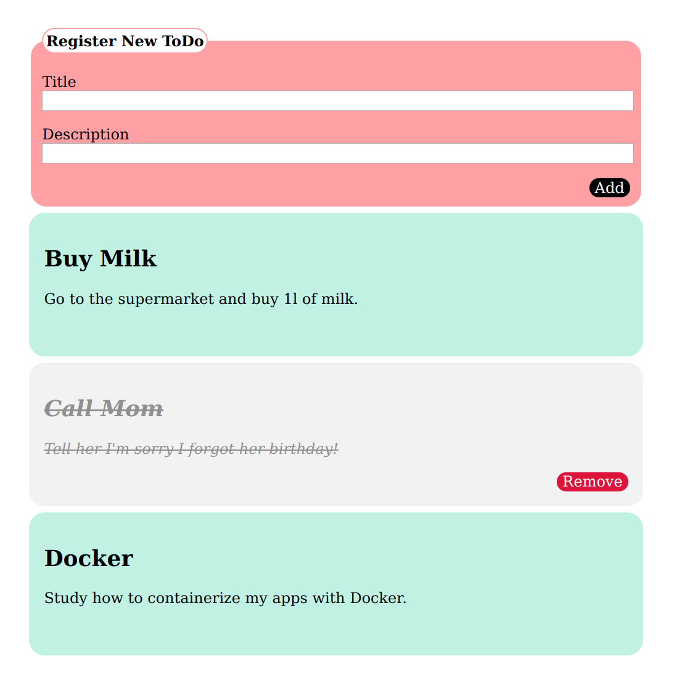

# &lt;/salt&gt;

## Salt ToDo

This is the classic Todo app exercise got as homework at SALT. This is my implementation of it. Requirements are listed below. 
You can view it and interact with it here: https://oanafatu.github.io/a-ToDo-app/src/

Your task is to create a simple todo app - no backend required.
Exactly how you implement and design this is up to you - but your solution should be implemented in the files `index.html`, `js/todo.js` and `style/todo.css`. You may use the screenshot at the bottom of this page as inspiration.

There is a webpack-dev-server already set up for you to get started developing quickly:

```npm run dev```.

You may not use any frameworks or libraries. SASS is OK.

### UI Requirements
* Initially, the list of todo cards should be empty.
* There should be a form where the user can add a new 'todo'.
* When a new todo task is submitted from the form, a new todo card should be appended to the list.
* Clicking on a todo card should visually mark the card as done. Exactly how is up to you.
* Add a remove-button to cards marked as 'done'. When the button is clicked, the card should be removed from the board.
* Move the cards marked as 'done' to the bottom of the list.

### Technical requirements
* Keep the application state in an object - the state must *NOT* be depedent on the DOM. The view should be dependent on the state, not the other way around. In its simplest form, this means that the state would be the list of todo’s stored as an array.
* Persist in localstorage. This is actually trivial once you have a state object: store the current state in the browser's localstorage. When the app is closed and then opened again, the state should be restored.
* Lint your code with Airbnb’s ESlint-configuration


### A few tips on the way
* Check the console, make sure it's clean before sending in the code
* Keep your code modular (build small functions, try to let each function have one single responsibility)
* Use modern JavaScript
* Think about naming your variables and functions in a way that make the code self-documenting
* Use a consistent naming convention (e.g. don't mix camel case & hyphens)
* Use semantic html (e.g use the form element)
* Use a css reset or normalize (or sensible defaults for elements)

Have fun!!

|  |
|:---:|
| Example of a todo app |
